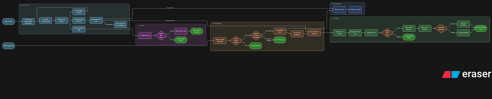

# 📲 OTP Forwarder App – Android Assignment

This Android application automatically receives OTPs via SMS, filters them based on trusted TPAs, and forwards them securely to a configured webhook endpoint. Built using Java and Android Jetpack components, the app is modular, fault-tolerant, and production-ready.

---

## ✅ Features Implemented

### 🔗 SMS Handling
- Receives SMS via `BroadcastReceiver`
- Extracts OTP using regex (`\b\d{4,8}\b`)
- Filters messages by TPA (e.g., `MANTYS`, `MNTYS`)

### 🌐 Webhook Relay
- Sends `{tpa, code, ts}` to a webhook
- Uses `OkHttp` with async callbacks
- Timestamps are ISO-8601 formatted

### 🔁 Retry & Expiry
- Uses `WorkManager` for offline-safe retry
- OTPs older than 3 minutes are dropped

### 📝 Event Logging & Export
- Last 100 events stored in local Room DB
- Exported as CSV to `Downloads/otp_logs.csv`

### 🧪 Developer & Debug Features
- Toggle to enable/disable receiver
- Test OTP button to simulate end-to-end flow

---

## 🧪 Unit Testing

- Regex and TPA filter logic covered via unit tests
- Payload formatting logic tested
- Due to Java 21 and Android mocking restrictions, tests avoid mocking `Context` and instead rely on Android instrumentation (if needed)

---

## 🔄 Application Flow (Simplified)

1. **SMS Received**
2. ✅ Check TPA sender → `AppConfig.TRUSTED_SENDERS`
3. ✅ Extract OTP → `AppConfig.OTP_REGEX`
4. ✅ Enqueue job → `OtpSender.enqueueOtp()`
5. ✅ Relay via HTTP → `SendOtpWorker`
6. ✅ Log event → `LogHelper` → Room
7. ✅ Export logs to CSV (Downloads) if triggered

---

## ⚙️ Background Handling & Delivery Guarantees

To ensure that OTPs are reliably received and relayed — even in real-world conditions like background execution, network issues, or phone-specific limitations — the app is designed to be resilient using Android Jetpack components.

### 🔁 OTP Relay via WorkManager

- OTPs are parsed and added to a **WorkManager job queue** immediately.
- This ensures:
  - ✅ Delivery happens even if the app is backgrounded or killed.
  - ✅ Webhook relay auto-retries on network failure.
  - ✅ Expired OTPs (older than 3 minutes) are dropped.
- This design ensures **offline-safe**, **battery-efficient**, and **crash-tolerant** behavior.

### 🪫 Power Optimization Bypass (Critical in Real Devices)

- On devices like **Samsung Galaxy S23** (tested), background receivers may not trigger unless the app is **excluded from battery optimization**.
- The app checks this state on resume and **prompts the user to exempt it** if needed.

### 🔒 Permissions Check

- On every app resume, it checks if `RECEIVE_SMS` permission is still granted.
- If revoked, the user is informed immediately to avoid silent failure.

### 🚫 No Default SMS App Requirement

- Although Android allows an app to register as the **default SMS handler**, this is often a **poor user experience** and unnecessary for this use case.
- The app avoids this and still receives OTPs successfully on most modern devices.

---

## 📐 Architecture Diagram

> 
> _(Replace with actual diagram before final delivery)_

---

## 🎥 Demo Video

📽️ [Watch Loom Demo](https://www.loom.com/share/your-demo-video-url-here)

---

## 🚀 How to Run

1. Clone or open the project in Android Studio
2. Connect a physical Android device (emulator will not receive real SMS)
3. Run the app → Grant SMS & storage permissions
4. Use:
   - "Enable OTP Forwarding" toggle to turn on/off listening
   - "Send Test OTP" to simulate a message and verify the relay
   - "Export CSV" to download the last 100 logs

---

## ✅ Done

- Built, tested, and verified end-to-end on a physical device
- Assignment features F1–F8 fully implemented

